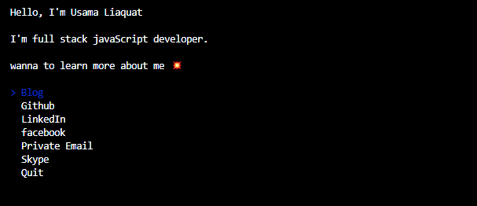

> The [Usama liaquat](https://www.linkedin.com/in/usama-liaquat-02045b121/) CLI




## Usage

[](https://greenkeeper.io/)

Install Node.js, then:

```
$ npx usamaliaquat
```


## Built with

- [ink](https://github.com/vadimdemedes/ink) - React for interactive command-line apps


## License

MIT © [Usama Liaquat](https://www.linkedin.com/in/usama-liaquat-02045b121/)
